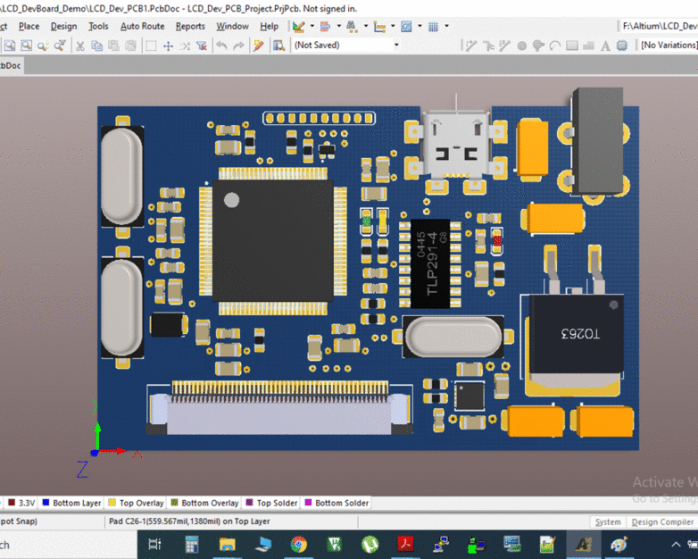
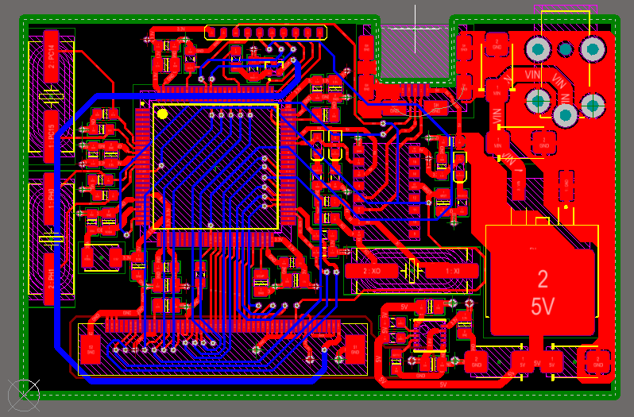
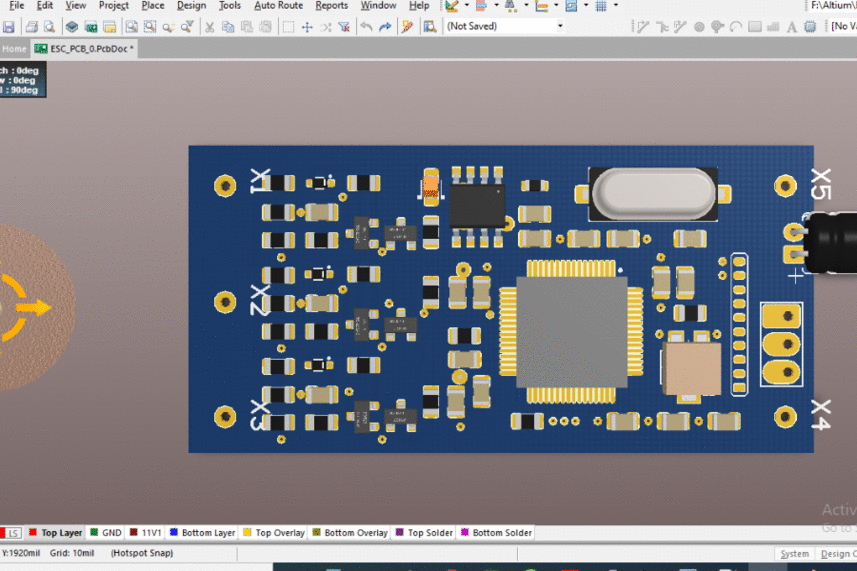
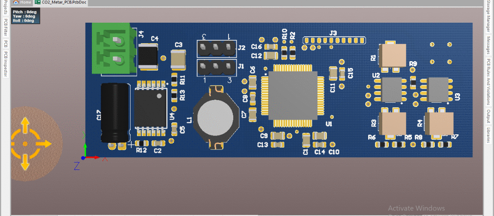

# Altium projects presentation

## LCD DevBoard demo
* this is only a concept demo. It has never been manufactured and therefore never tested.

* The following photos show one manufactured board. 
* This is an adapter board for STM Nucleo-144 boards, but is only tested for stm32f413zht6.
* It is an adapter for STM Zio connectors (CN/,8,9 10) to FPC/FFC 50pin connector used for i80-like communication with an LCD driver controller (NT35510) used on a LCD display module (ER-TFT040_1)
 
 
 
  

## ESC board demo
* this is only a concept demo. It has never been manufactured and therefore never tested.

## CO2 meter board
* this is only a concept demo. It has never been manufactured and therefore never tested.

